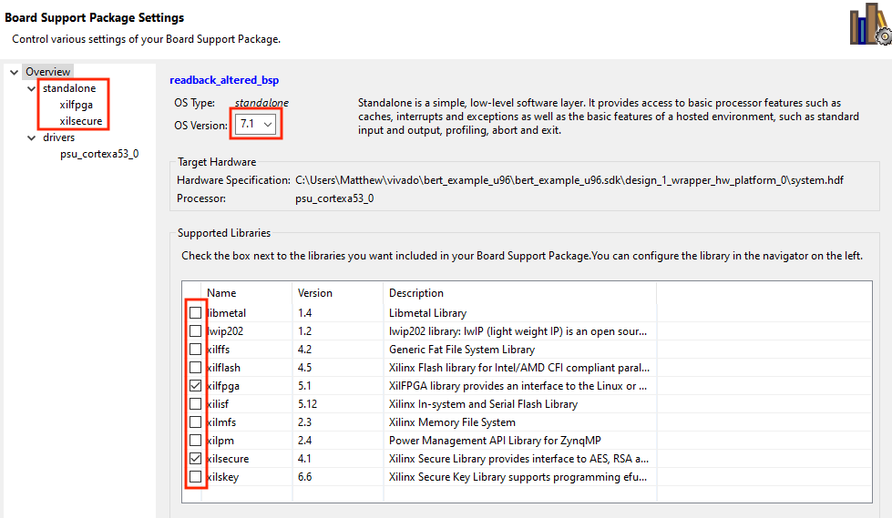
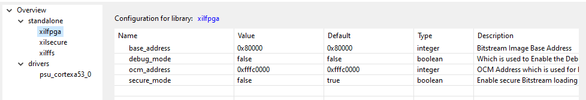
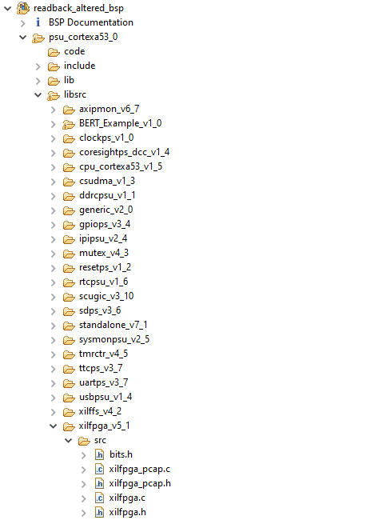

Configuring Board Support Package (BSP) for xilfpga (v5.1) library
========================

For the loading and reading of configuration frames, BERT uses a modified version of xilfpga v5.1, found in the [2019.2 distribution of embeddedsw](https://github.com/Xilinx/embeddedsw/releases/tag/xilinx-v2019.2). xilfpga depends on xilsecure, which can also be found at the 2019.2 link. These two libraries must be imported into the board support package and linked against the application code. The [SDK setup tutorial](../tutorials/sdksetup.md) outlines how to prepare the SDK before configuring the BSP.  Make sure you have completed those steps (up until it sends you to this page) before proceeding.

## Xilinx SDK 2018.3 Installation

Since SDK 2018.3 predates the distribution of xilfpga being used, the [2019.2 distribution of embeddedsw](https://github.com/Xilinx/embeddedsw/releases/tag/xilinx-v2019.2) must be manually added to the SDK installation. If Vitis (2019.2 or newer) is being used, this portion of the document can be skipped. Extract the .zip archive.  Assuming you extracted it to /tmp (and SDK below is the Xilinx installation SDK directory) then you would want to copy:

* `cp -r /tmp/embeddedsw-xilinx-v2019.2/lib/sw_services/xilfpga \       SDK/2018.3/data/embeddedsw/lib/sw_services/xilfpga_v5_1`
* `cp -r /tmp/embeddedsw-xilinx-v2019.2/lib/sw_services/xilsecure \        SDK/2018.3/data/embeddedsw/lib/sw_services/xilsecure_v4_1`.
* `cp -r /tmp/embeddedsw-xilinx-v2019.2/lib/bsp/standalone \        SDK/2018.3/data/embeddedsw/lib/bsp/standalone_v7_1`.

where 2018.3 can be replaced with the version you are using (only needed if your SDK is prior to 2019.2). Notice the snake case version endings added onto the destination folders. 

Adding the newer versions to a local SDK installation will allow the libraries be added to the bsp using the normal procedure (the dropdown menu in system.mss). After restarting the SDK, the new versions of xilfpga and xilsecure should show up in the drop down menu of a Board Support Package's settings window. This step is shown in detail further down.

Some additional tweaking may be required for C++ code. Since xilfpga and Xilinx bsp libraries in general are written in C, `extern "C"` blocks need to be used to ensure the code compiles. Xilinx libraries have these `extern "C"` blocks, but with typos that prevent compilation. For C++ code to compile, you must manually fix these typos within the xilsecure library: [Extern "C" closure should not include "extern c", but only the curly brackets](https://github.com/Xilinx/embeddedsw/pull/115). C code should compile fine without any of these concerns.

**TODO: clarify what, if anything needs to be done here.**

**TODO: mention how BERT is affected when using C++ linkage depending on how we change bert.h**

## BSP Configuration
BERT runs on the standalone platform (v7.1). First, update the baseline board support package with xilfpga v5.1, xilsecure v4.1, and standalone v7.1. The only change required from the default settings for the libraries is `secure_mode` should be set to `false` within xilfpga settings. The BSP should automatically recompile after applying the changes. If a board support packages does not exist in your active SDK workspace, instructions on how to create a application project and BSP can be found [here](../tutorials/sdksetup.md).

Since BERT takes advantage of custom API calls, xilfpga must be overwritten in the BSP with the modified version found at `bert/embedded/libsrc/xilfpga_v5_1`. After a bsp is generated, overwrite the xilfpga library found at `xxx_bsp/psu_xxxx_x/libsrc/xilfpga_v5_1` with the version in the BERT repo. You can do this by just dragging and dropping the files into the SDK GUI. The overwrite should trigger the SDK to recompile the bsp libraries. You will see cross compiler output in the 'Console' window as the BSP is regenerated. If other bsp parameters are changed in `system.mss` or the `Re-generate BSP Sources` button is clicked, the bsp will be regenerated. This means the modified version of xilfpga will be overwritten with the vanilla xilfpga version from the local SDK installation. Thus, it is best to completely configure the rest of the BSP before emplacing the custom xilfpga library. Once configured, the same bsp can be used for multiple applications. The BSP is setup in this roundabout way is because: (a) SDK 2018.3 does not have a recent enough version of xilfpga and (b) overwritting xilfpga within the BSP does not tamper with the software included in the SDK installation. 

The picture shows the part of the bsp directory structure being overwritten.

Now we are fully preapred to launch the debug session. Launch the debugger and wait for the program and bitstream to load over JTAG. By default, the program breaks at the start. Press the 'play' button and observe the hopefully correct output in the SDK Terminal.

Once the BSP is set up, it can be used for all application projects in the SDK workspace. The next step is to integrate BERT into an application. Instructions for doing so can be found [here](bert.md).
