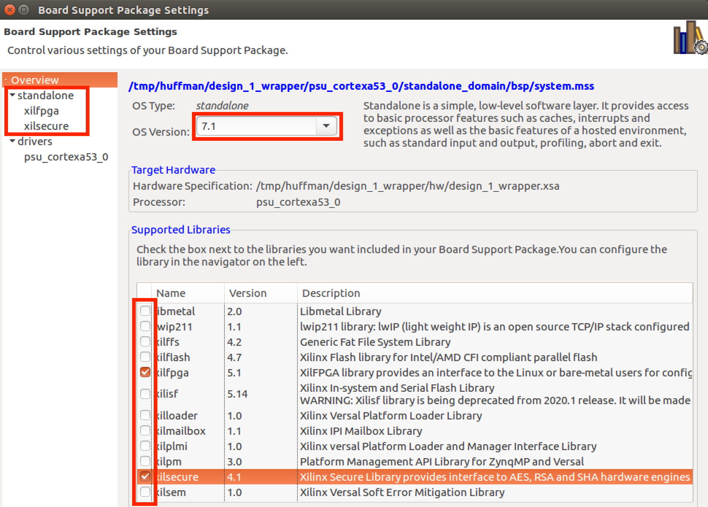

# Configuring Your Board Support Package (BSP) for xilfpga (v5.1) library

## SDK Instructions
Open the BSP and modify its settings.  To do this, you expand the BSP (`huffman_demo_bsp`) on the left of Project Explorer and then open `system.mss`.  From there you will see a "Modify This BSP Settings" button in the middle of the screen.  Click that.

BERT runs on the standalone platform (v7.1), xilfpga v5.1, and xilsecure v4.1 (see below and select as shown).

On the left side of the screen under 'standalone' you will see 'xilfpga' and 'xilsecure' options.
 * Select `xilfpga` and make sure `secure_mode` is set to false.
 * Select `xilsecure` and make sure `secure_environment` is set to false.
 * Finally, you should click `standalone` and set the `stdout` setting to 'psu_uart_1' so print statements can be read over JTAG.

Then click OK and you will have configured your BSP.

---
## Vitis Instructions
On the left of Explorer, double click `huffman_demo.prj` (you may have to expand `huffman_demo_system` and then expand `huffman_demo` inside it to see `huffman_demo.prj`.  Then click 'Navigate to BSP Settings' and then click 'Modify BSP Settings'.  There is a UI initialization step that can be slow - the 'Modify BSP Settings' button may be grayed out for as long as 20 seconds while the UI initializes - be patient.

BERT runs on the standalone platform (v7.1), xilfpga v5.1, and xilsecure v4.1 (see below and select as shown).

On the left side of the screen under 'standalone' you will see 'xilfpga' and 'xilsecure' options.
 * Select `xilfpga` and make sure `secure_mode` is set to false.
 * Select `xilsecure` and make sure `secure_environment` is set to false.
 * Finally, you should click `standalone` and set the `stdout` setting to 'psu_uart_1' so print statements can be read over JTAG.

Then click OK and you will have configured your BSP.

