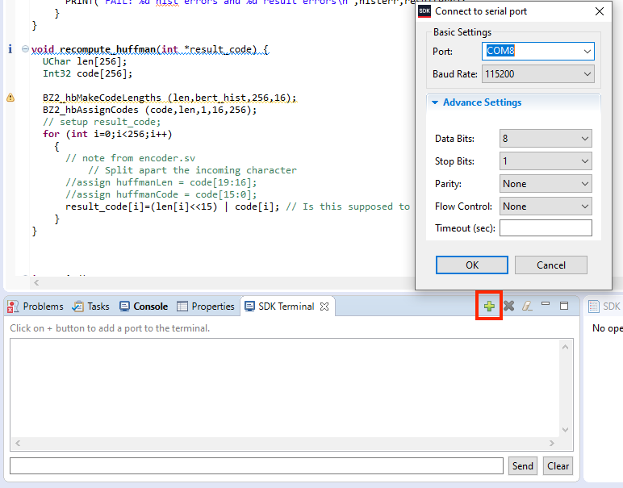
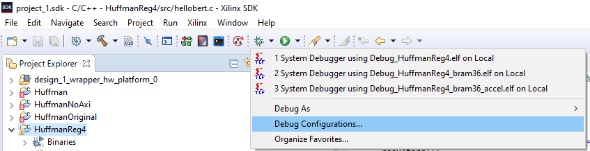
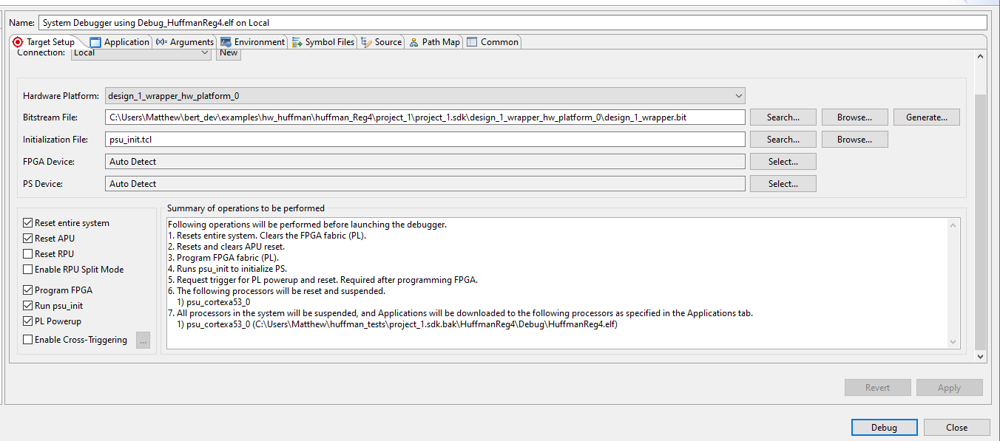

# Huffman Encoder Tutorial
## Overview
This tutorial will lead you through using BERT to read and write memories in a hardware design.

The hardware for the project is a Huffman Encoder design where 4 memories are used:
* A 1024x8b memory with 8b characters that will be encoded, called `rawTextMem`
* A 256x20b memory with character encodings, called `huffmanMem`. Bits [0:15] of each word are the encoding. Bits [16:19] are the length of the encoding.
* A 512x16b memory with that stores the encoding of `rawTextMem`, called `resultsMem`
* A 256x16b memory that stores a histogram of `rawTextMem`'s values, called `histMem`

**TODO: pix show application flow**

rawTextMem->encode(huffmanMem)-->resultMem
                    |->histMem

In the design, the memories can be read and written by BERT.  However, we have also hooked some of the memories up to the AXI bus so we can also read and write them that way to verify that things are operating correctly.

When the design is running, if the sotware  toggles a register bit on the AXI bus that will cause the encoder to run and the  `resultsMem` to be updated with the encoding of `rawTextMem`, based on the dictionary found in `huffmanMem`. Additionally, `histMem` is updated with a new histogram of `rawTextMem`. In order to verify that BERT is actually working, the design allows us to read `resultsMem` and `histMem` over AXI.

During runtime, the software can also do the following by writing or reading the BRAMs in the hardware:
* Setting the text that needs to be encoded
* Providing different Huffman dictionaries for the hardware encoder as needed
* Debugging by reading memories that wouldn't ordinarilly be exposed to AXI, like `histMem`.

This tutorial will demonstrate performing these hypothetical scenarios with the BERT API. Additionally, this document serves to explain how to get BERT working with any hardware design. Every step is covered from start to finish, with links to documents providing further information. 

Finally, this tutorial is written with the Eclipse-based Xilinx SDK in mind. The [Xilinx article on migrating to Vitis](https://www.xilinx.com/html_docs/xilinx2020_1/vitis_doc/migratingtovitis.html) may help in adapting these instructions for newer versions of the Xilinx tools.

## Steps At-A-Glance
Using BERT is a 4-step process.  
1. Use BERT host tools to generate the mydesign headers for your hardware design. You will do this each time you have a new design ready to run with BERT.  You do this on a "host" computer.   
     1. You will first build the BERT host tools for your platform.  You do this only once.
     2. You will then run the `bert_gen` tools on your design to produce the files needed by the SDK for your BERT  application.  This will produce a set of files which are used to build BERT applications to talk to our design.  You will do this every time you have a design to run through BERT.
2. You will need to set up Xilinx SDK environment with the right versions of the xilfpga program from Xilinx as well as the needed files and libraries for BERT.  You should only need to do this once. 
3. Once this is all in place, you will install the BERT source code itself and then write user code, all of which will compile into a BERT executable that uses BERT to talk to the board after you have programmed it with a bitstream.  
4. You will finally test that application on hardware with a bitstream programmed onto the board.

NOTE: along the way you will be copying files into the SDK project directories.   As you do so you may see compile errors in the Project Explorer window on the left of the SDK.  You will have such compile errors until right at the end of Step 3 below so don't worry about them until you get to that point!  The tutorial will tell you when you should not have any compile errors any more.

# Step 0. Obtaining A Sample Design
Before you begin the 4-step process above, you need to create your hardware design in Vivado and compile it to a bitstream and then write out a hardware specification (.hdf) file and a design checkpoint (.dcp) file.

For this tutorial, however, a .hdf and .dcp file are provided for you within the bert GIT repo for the Ultra96-V2 board to save time.  You can find those in this directory: `.../bert/docs/tutorials/huffman/hw_huffman` in the repo.  Copy the files in that directory into a directory where you intend to work through this tutorial.

# Step 1. Using bert_gen to Generate mydesign.c and mydesign.h
The first step is to set up `bert_gen` and then use it to process your design  To learn how to do that go to the [bert_gen setup and usage page here](../../host_tools/README.md).  Note that when following the instructions there, the name to use for `headerName` as instructed must be `mydesign` for the rest of the flow to work properly.

# Step 2. Setup Xilinx SDK Environment With The Proper Libraries and Add Libraries to Your BSP
The next step is to set up the Xilinx SDK environment.  This tutorial was written for Vivado 2018.3 but the BERT tools require `xilfpga` libraries for 2019.2 and so there are a number of steps required to get the proper libraries and files set up.

* Step 2a - follow the instructions [here on SDK setup](../sdksetup.md).  This will set up your SDK environment.

* Step 2b - you next need to add some required library to your BSP.  Libraries are added by opening the system.mss file within the bsp directory. You will need to add some new libraries to your board support package.  The document [bsp.md](../embedded/bsp.md) covers which libraries and versions you will need for BERT as well as other additional steps.  Complete those steps before proceeding.

* Step 2c - adding a library to a bsp after a project has already been formulated sometimes causes an issue where the makefile is not updated to link against the new libary. If you are getting compiler errors, you can check that the right flags are set by opening the application project's properties (huffman_demo's properties). Once there, go to C/C++ Build -> Settings -> ARM v8 gcc linker -> Inferred Options -> Software Platform. The specific flags you are looking for as they relate to BERT include:

* `-Wl,--start-group,-lxilfpga,-lxil,-lxilsecure,-lgcc,-lc,--end-group`
*  `-Wl,--start-group,-lxilsecure,-lxil,-lgcc,-lc,--end-group`

NOTE: we have seen these get reset by the SDK when switching workspaces, among other things.  So. if you are getting compile errors, re-check them!
# 3. Integrating BERT into Your Project and Writing Your Source Code
1. Now that we have an application project and bsp established, we need to copy the BERT system's source files from `.../bert/embedded/src/bert` into our application project's `src`. (Or you could copy the whole `bert` directory if you'd like to maintain some heirarchy within your `src` directory. If you do so, just adjust the `#include` directives to reflect this.)
2. The easiest way is to do this is to just copy and paste the files using your OS's file manager, but alternatively you could use the import feature since Xilinx SDK is Eclipse-based. 
3. So, copy those files over now.  
4. Also, you may notice that you have a `helloworld.c` file in the `src` directory (often automatically created by SDK when you create the application).  If so, remove the `helloworld.c` fle.
5. Next, copy the `mydesign.c` and `mydesign.h` files generated by `bert_gen` up above into your application's source directory.

## Write User code
The next step is to write an actual application to use BERT to interact with your design.  We provided a sample application [hellobert.c](./sw_huffman/hellobert.c) that you can use for this.  It does the following:
* Reads the memories over AXI and BERT to verify BERT is working.
* Uses a bzip2 implementation of Huffmann encoding to create a new dictionary on the PS side and transfer it via BERT.
* Writes ascending input to the `rawTextMem` and an identity encoding as the Huffman dictionary.

As mentioned above, if the project was initially created with any sample code (like helloworld.c or anything else that includes a main method), delete it now. Then, copy over all the code in `.../bert/docs/tutorials/huffman/sw_huffman` into the project application's `src` folder.

This includes:
* bzlib.h, bzlib_min.c, bzlib_private.h, huffman.c, spec.c, spec.h - this is code from bzip2 for Huffman encoding on the PS
* hellobert.c - this is code that tests the BERT operations on the Huffman encoder memories

Next, the `hellobert.c` file you just copied over needs some `#defines` added to it so it knows the names of the memories:
```
#define MEM_INPUT MEM_0
#define MEM_HUFFMAN MEM_1
#define MEM_HIST MEM_2
#define MEM_RESULT MEM_3
```
Add these up near the top of the file.

Next, you need to tell the application how much memory to use.  In the `src` directory click the file `ldscript.ld`  file and increase the stack and heap sizes by adding two 0's to their values.

At this point you FINALLY have a complete application and it should show no compile  errors in Project Explorer!

## 4. Test on hardware

If the code compiles, you are ready to run it on hardware. Start by opening "Debug Configurations."  You can do this by right-clicking on the project application ('huffman_demo') and selecting 'Debug As->Debug Configurations'.  Then choose the bottom option n the window that pops up ('Xilinx C/C++ application (System Debugger)').  

In the Target Setup you need to select a number of reset options like below:


Before or during the launch of the debugger, open the serial port to the board so we can observe the program output. Clicking the green plus sign in the "SDK Terminal" window accomplishes this.  On Windows it wll be a COM port, on Linux it will be /dev/ttyUSB1.



If all goes well, the program will run and will print resujlts to the SDK Terminal.  As of the time of the writing of this the BERT readback is broken and so you will get a long series of mismatch errors terminating with the following:
```
result[1] = 7F4D
result[2] = FEFC
result[3] = FF58
```

Congratulations!  You have run a successful demo application.

Obvious next steps would be to experiment with making changes to the `hellobert.c` program and re-run it on the board to gain some experience with the board and the BERT API.  Then, run a design of your own creation through the process.


---

---

---
# Stuff That May Not Necessarily Belong Here in the Tutorial But Which We Don't Want to Lose
TODO: *JAMES* - review:
* Create a .dcp file for the fully complete placed and routed design.
  Command below assumes this is called  `design.dcp`
* Run: `.gen.sh -gen design.dcp designHeaderName`
* This should create `deignHeaderName.h` and `designHeaderName.c` that will
  be used with BERT applications below. This is what is being referred to whenever the docs generically mention `mydesign.h`.

---

You can now refer to [the BERT API document](../../embedded/bert.md) for more details about BERT API in general. 

TODO: Explain how to #define the different memories since the memories are indexed differently each time they are produced by bert_gen


**TODO: Picture of application projects directory structure**

---

**TODO:**
* Make sure application works with new changes of BERT (readback_Init takes a IDCODE).
  * just replace U96_IDCODE with IDCODE?
  * IDCODE also defined somewhere in xilfpga?  so need to remove that definition of IDCODE?
* Create #ifdef macros so the code has the same functionality using bert_read/write or bert_transfuse
* Make sure code runs without buffers excessively sized like they are right now.
* Reduce amount of repeated code so its more easily understandable

---




Double clicking on "Xilinx C/C++ application (System Debugger) will create a new debug launch configuration. Here is an example of a configuration:



Notice the "Bitstream File" field. If you are developing different versions of the hardware design concurrently (the BRAMs do not change), one can just point to the different bitstream. This way, one can avoid establishing a new SDK workspace and generating a new BSP for every change to the hardware. From a practical standpoint, nothing prevents having two projects in the same SDK workspace for two different hardware designs (for the same part).

---

TODO:
* Mention the on button and reset button on board
* Mention compiling BERT with -O3 (Perhaps find a way for SDK to only compile BERT -O3)
* Section on how to Debug

