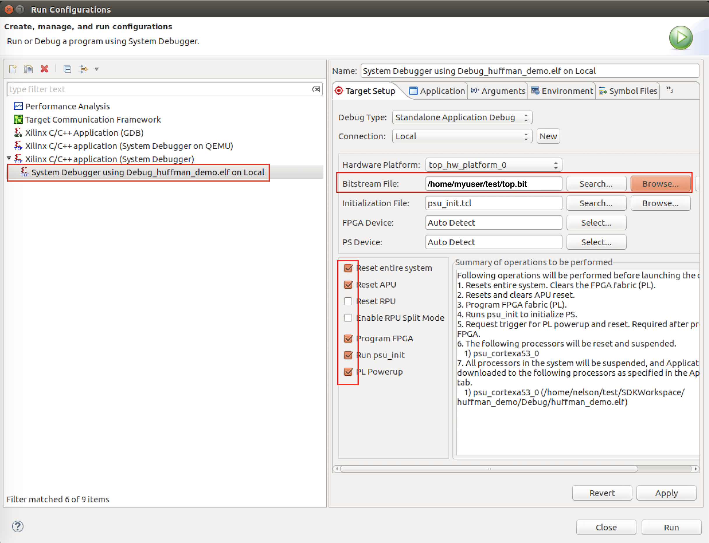
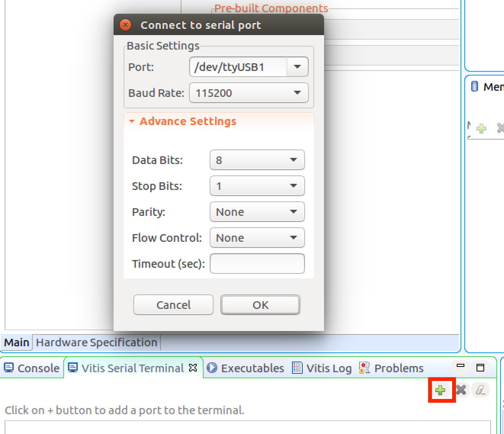

# Huffman Encoder Tutorial
## Overview
This tutorial will lead you through using BERT to read and write memories in a hardware design.  

The tutorial covers the use of BERT with both Xilinx SDK (Xilinx tools 2019.1 and earlier) as well as with Vitis (Xilinx tools 2019.2 and later).  At times below, there will be instructions to copy files from a particular directory or to run a particular script within the repo.  An example would be copying the sample hardware design files: `.../bert/docs/tutorials/huffman/hw_huffman_sdk` or `.../bert/docs/tutorials/huffman/hw_huffman_vitis` (depending on which tool is used). To simplify the discussion, that location would be listed as `.../bert/docs/tutorials/huffman/hw_huffman_TOOL` - you would need to replace the word `TOOL` with either `sdk` or `vitis`.  In addition the `.../bert/` represents the location where your BERT repository exists on your computer.

The hardware for the project is a Huffman Encoder design where 4 memories are used:
* A 1024x8b memory with 8b characters that will be encoded, called `rawTextMem`
* A 256x20b memory with character encodings, called `huffmanMem`. Bits [15:0] of each word are the encoding. Bits [19:16] are the length of the encoding.
* A 512x16b memory with that stores the encoding of `rawTextMem`, called `resultsMem`
* A 256x16b memory that stores a histogram of `rawTextMem`'s values, called `histMem`

In the design, the memories can be read and written by BERT.  However, we have also hooked the memories up to the AXI bus so we can also read and write them that way to verify BERT's correct operation.


The software toggles a bit in a control register exposed to the AXI bus. This causes the encoder to update `resultsMem` with the encoding of `rawTextMem`, based on the dictionary found in `huffmanMem`. 

During runtime, the software can do the following by writing or reading the BRAMs in the hardware:
* Setting the text that needs to be encoded
* Providing different Huffman dictionaries for the hardware encoder as needed
* Debugging by reading memories that wouldn't ordinarilly be exposed to AXI, like `histMem`.

This tutorial will demonstrate performing these hypothetical scenarios with the BERT API. Additionally, this document serves to explain how to get BERT working with any hardware design. Every step is covered from start to finish, with links to documents providing further information. 

<!--Finally, this tutorial is written with the Eclipse-based Xilinx SDK/Vitis in mind. The [Xilinx article on migrating to Vitis](https://www.xilinx.com/html_docs/xilinx2020_1/vitis_doc/migratingtovitis.html) may help in adapting these instructions for newer versions of the Xilinx tools.-->

## Prerequisites
This tutorial assumes the user has some experience with using the Xilinx SDK tool to create, configure, edit, compile, and run designs consisting of hardware and software on an FPGA board.

The tutorial also assumes you have the following installed:
* Xilinx SDK or Xilinx Vitis
* Python3


## The Overall Process
Using BERT is a 5-step process.  
1. You use Vivado to generate a design containing BRAMs and a PS.  Once you have generated a bitstream for the design you run a script to generate the needed data files for the remainder of the BERT process.  You do this on a "host" computer, meaning one that runs Vivado.
2. If running SDK, you then set up the Xilinx SDK environment with the right versions of the xilfpga program from Xilinx.  This only needs to be done once per
installation site.  This is not needed for Vitis.
3. You then create an SDK/Vitis project for the provided hardware design.  As a part of this you setup your board-support package with the needed modified libraries for BERT. 
4. Once this is all in place, you will install the BERT source code itself inside your application and write your user application code, all of which will compile into a BERT executable that uses BERT to talk to the board after you have programmed it with a bitstream.  
5. You will finally test that application on hardware with a bitstream programmed onto the board.

## Step 1. Obtaining A Sample Design
As mentioned, the first step is to create your hardware design in Vivado, compile it to a bitstream, and then write out the needed files for BERT to use your design.

For this tutorial, however, a complete set of such files are provided for you within the bert GIT repo for the Ultra96-V2 board to save time.  You can find those in this directory: `.../bert/docs/tutorials/huffman/hw_huffman_TOOL` in the repo.  Copy the files from there into a directory where you intend to work through this tutorial (which we will refer to as `WORK` for the rest of the tutorial).  

## Step 2. Setup Xilinx SDK With The Proper Libraries.
If you are running SDK, the next step is to set up the Xilinx SDK environment.  This tutorial was written for Vivado 2018.3 but the BERT tools require `xilfpga` libraries for 2019.1 and so there are a number of steps required to get the proper libraries and files set up. Follow the instructions [here on 2018.3 setup](../../embedded/xilinx2018_3.md) if you are running a version of Vivado prior to 2019.2.  This will set up the files you need in your SDK environment.  You should only have to do this once per installation site.  Obviously, this is not needed for Vitis since it pertains to Xilinx 2019.2 and later.

## Step 3. Create an SDK/Vitis Project and Modify the BSP With the Proper Library Code
* Step 3a - follow the instructions
  [here on Application Project Setup](../sdksetup.md).  This will create
  the SDK/Vitis application project.

* Step 3b - you next need to add some required libraries to your BSP.  [This
  document on BSP Setup](../../embedded/bsp.md) covers which libraries and
  versions you will need for BERT as well as other additional steps.  Complete those steps before proceeding.

* Step 3c - you now should check the project's link settings.  This is because adding a library to a BSP after a project has already been formulated sometimes causes an issue where the 'makefile' is not updated to link against the new libary. If you are getting compiler errors, you can check that the right flags are set by opening the application project's properties (right-click `huffman_demo` and choose C/C++ Build Settings). Then, go to ARM v8 gcc linker -> Inferred Options -> Software Platform. The specific flags you are looking for as they relate to BERT include:

* `-Wl,--start-group,-lxilfpga,-lxil,-lxilsecure,-lgcc,-lc,--end-group`
*  `-Wl,--start-group,-lxilsecure,-lxil,-lgcc,-lc,--end-group`

Add these if they are missing.  NOTE: we have seen these get reset by the SDK/Vitis when switching workspaces, among other things.  So, if at the end of the process you are getting compile errors, re-check these settings!

## Step 4. Integrating BERT into Your Project and Writing Your Source Code
Now that you have an application project and BSP established, you need to assemble the needed source code files to create your BERT application.  To simplify this a script has been created which will copy the needed files into your applicationn source directory for you.  If you are running SDK that source directory will be `WORK/SDKWorkspace/huffman_demo/src`.  If you are running Vitis that source directory will be `WORK/huffman_demo/src`.  Here are the files that will be copied:

1. It first copies the BERT source files (which make it run).  These files are found in `.../bert/embedded/src/bert`.
2. It next copies the `mydesign.c` and `mydesign.h` files you copied into `WORK` at the start of this tutorial.  These define a set of data structures that describe, for the BERT system, the names, locations, and contents of the BRAMs in the specific hardware design that will be executed.
3. Finally, it copies the actual application program (contains a `main()` routine).  It is called `hellobert.c` and is found at `.../bert/docs/tutorials/huffman/sw_huffman` (along with a set of support source files it needs).

To copy these all into your source directory now do this:
```
python3 .../bert/docs/tutorials/huffman/copyappfiles_TOOL.py WORK
```
where `TOOL` is either `sdk` or `vitis`.

Next, you may also see that your application source directory has a `helloworld.c` file in it (often automatically created by SDK/Vitis when you create the application).  If so, remove that file before proceeding.
### The Application
The provided `hellobert.c` application source code (mentioned above) does the following:

* Reads the memories' contents from the design using both the AXI interface as well as the BERT interface.  It then compares the results of those reads to verify BERT is working.
* After that, it uses a bzip2 implementation of Huffmann encoding to create a new encoding table and writes that new encoding table into `huffmanMem` memory in the running design via BERT.
* It then writes ascending input to the `rawTextMem` and an identity encoding as the Huffman table in the running design, and then checks the encoded results in the `resultMem` to verify they are correct.

The application allocates memory to use for its activities.  Before executing it, you need to tell the SDK how much memory it will use.  To do this, edit the `ldscript.ld` in SDK:
* On the left, if necessary, click on triangle to the left of huffman_demo to list its contents
* Click on triangle to the left of src to list its contents
* Double-click the on `lscript.ld` file to open.

The default heap size of the program is too small to store the configuration frames needed to write to memories. In the worst case, all 4 memories exist in different frame ranges. The bits of a BRAM36/18 span 256 frames (+1 dummy frame for flushing the data). Thus, we need enough memory to hold 4 x 257 frames, and each frame is 93 x 4 bytes. So the approximate memory usage is 382,416 bytes. Round up and set the heap size to 0x60000 (6 followed by 4 zeros -- this is hex for roughly 400 kilobytes).  For more discussion on how to size the heap, see the 'Dynamic Memory Usage' section in [the BERT API documentation](../../embedded/bert.md). Once changed, select File->Save from top menu to apply the changes and rebuild the program.

At this point you have a complete application.  Right-click the application (`huffman_demo`) in the Project Explorer and select 'Build Project' to get a complete build done.

Note: the `copyappfiles_TOOL.py` script you ran above copied a number of source files to assemble what you need for a BERT application to run.  By examining the output printed out while running that script you should be able to determine what pieces of source code were copied into your SDK application project (`huffman_demo`).  You can use the output of `copyappfiles_TOOL.py` as a guide when you get ready to do your new design later and have to assemble the source code files yourself.

## Step 5. Test on hardware

Once the code compiles, you are ready to run it on hardware. 

### SDK Instructions
Start by opening "Run Configurations."  You can do this by right-clicking on the project application (`huffman_demo`) and selecting 'Run As->Run Configurations'.  Then double-click the bottom option in the window that pops up ('Xilinx C/C++ application (System Debugger)').  

In the Target Setup pane to the right you will need to select a number of reset options like below:



In addition you will have to fill in the name of the bitfile to use.  You do this by clicking the Browse Button and selecting the file `WORK/top.bit`.
Once you have done so, click Apply and then Close.  At this point you have a new configuration you can use when you run with or without the debugger.

As shown below, to run, click the green circle with white triangle at the top center of the screen.  This will run what you just created.


Watch the lower right screen - you will see it going through a whole series of startup steps - loading code, programming the FPGA, resetting the system, etc.  This can take as long as 30 seconds.  When it all finishes and runs the actual application the focus will switch to the console window in the lower center of the screen.  That will be your cue that the application has run.  You can click on the 'SDK Terminal' tab to see the results of the run.

Before or during the launch of the program, open the serial port to the board so you can observe the program output. Clicking the green plus ('+') sign in the "SDK Terminal" tab's window accomplishes this.  On Windows it will be a COM port, on Linux it will be /dev/ttyUSB1.


Alternatively, you can run the debugger using the debug icon just to the left of the run button (this icon looks like a bug).  This will run the debugger.  The debugger will start up with a breakpoint at main.  To resume execution, select Core 0 and press the `Resume` button, which is shaped like a play button (rectangle followed by green arrow, two icons over from the run button).

If all goes well, the program will run and will print results to the SDK Terminal as shown below:


Congratulations!  You have run a successful demo application using BERT.

### Vitis Instructions
Start by opening "Run Configurations."  You can do this by right-clicking on the project application (`huffman_demo`) and selecting 'Run As->Launch on Hardware (Single Application Debug)'.   This will run the application.

But first, if you select the 'Debug Perspective' (upper right of screen), the 'Vitis Serial Terminal' will show up near the bottom of the window. You should next open the serial port to the board so you can observe the program output. Click the green plus ('+') sign in the "Vitis Serial Terminal" tab's window accomplishes this.  On Windows it will be a COM port, on Linux it will be /dev/ttyUSB1.



Later, to run again, just click the green circle with white triangle at the top center of the screen.  This will run what you just created.


Watch the lower right screen - you will see it going through a whole series of startup steps - loading code, programming the FPGA, resetting the system, etc.  This can take as long as 30 seconds.  When it all finishes and runs the actual application the focus will switch to the console window in the lower center of the screen.  That will be your cue that the application has run.  


Alternatively, you can run the debugger using the debug icon just to the left of the run button (this icon looks like a bug).  This will run the debugger.  The debugger will start up with a breakpoint at main.  To resume execution, select Core 0 and press the `Resume` button, which is shaped like a play button (rectangle followed by green arrow, two icons over from the run button).

If all goes well, the program will run and will print results to the SDK Terminal as shown below:


Congratulations!  You have run a successful demo application using BERT.

## 6. Next Steps and Further Instructions

### Experiment With The `hellobert` Program
The obvious next step would be to experiment with making changes to the
`hellobert.c` program and re-run it on the board.  This will allow you to gain some experience
with the board and the BERT API.  

### Run Tutorial #2
Next, work your way through the second BERT tutorial,
[Preparing Needed Files for the Huffman Encoding Tutorial](fileprep.md).  This will teach you 
how to generate the files from a Vivado design and which are needed to run BERT with that design. These are the files that were given to you at the start of this tutorial.
### Run a Timing version of `hellobert.c`
Follow the tutorial at [Timing Version of `hellobert.c`](timing/README.md) to capture
times for bert operations and components.

### Compile with -O3 to Run Translation Fast
  * Right click bert.c to optimize just translation or right click huffman_demo on left pane to optimize the entire project. In either case, select properties in the drop down.
  * Look under C/C++ Build > Settings
  * Then look under ARMv8 gcc compiler > Optimizations
  * Set Optimization Level to -O3
  * Click Apply
  * Click OK

### Using `(* dont_touch = "true" *)`
When you use BERT to read and write memories, there may be cases where BERT is the only mechanism whereby a particular memory gets read (imaging a debug memory which is only written to).  In these cases, Vivado may optimize the memory away after determinining that its contents are never read by the design.  To prevent this from happening you may need to add a `dont_touch` attribute to the HDL code when declaring an array which will be synthesized into a memory as in this:
```
 (* dont_touch = "true" *) (* ram_style = "block" *) reg [15:0] ram [1024];
```
This will prevent Vivado from optimizing the memory away if it is not read from.
### Accelerate BERT 
You can run an [accelerated version of translation](accel/README.md) to speed up
  translation on simpler memories (all the memories in this design are
  simple enough)
* To change the DMA transfer speed, modify PCAP_READ_DIV or PCAP_WRITE_DIV in xilfpga_pcap.h in the BSP file
  * By default, we have it set to a high speed that works for us
    * set it lower (higher values) if that times out for you
    * set it higher (lower values) if you want to try running faster
    * default value of 10 corresponds to about 150MHz; highest value of 63 (default from Xilinx) is about 24MHz
  * On the project navigator plane on left
    * open huffman_demo_bsp
    * open psu_cortexa53_0
    * open libsrc
    * open xilfpga_v5_1
    * open source
    * double click on `xilfpga_pcap.h`
  * look for `#define` for `PCAP_READ_DIV` (`PCA_WRITE_DIV` is right after it)
  * change values there
  * save file (File>Save)

## First Troubleshooting Steps (Specific to the tutorial and BERT in general)

* Program will not compile
  * Right click the project then click 'Clean Project' to make sure there are no stale builds. Doing this rebuilds the BSP as well.
  * Check that all bert files are present in /src: bert.c/h , bert_types.h, readback.c/h, ultrascale_plus.c/h
  * Check that the Huffman code is present in /src: bzlib_min.c, bzlib_private.h, bzlib.h, hellobert.c, huffman.c, spec.c, spec.h
  * Check that xilfpga patch hasn't been overwritten back to the default state (For instance, this happens when changing a uart setting). If so, copy xilfpga again.
  * Check project's linker flags are set. They sometimes get wiped out. See step 3c.
* Cannot launch program
  * Make sure the device (U96) is powered on and connected to the host.
    * The boot mode switch is set to JTAG mode
    * The barrel jack power cable is plugged in
    * The JTAG pod is attached to the board
    * The micro-USB to USB cable is attached to the JTAG pod
    * The power button has been pressed once (the button behind the inner USB port).
  * Press the reset button on the board (the button behind the USB port closed to the edge of the board). This is sometimes needed between program launches.
* Program hangs (never finishes)
  * Check that the heap size is large enough. The default size is not! See step 4, section 'The Application.'
  * If bert_read/write returns `BST_XILFPGA_FAILURE`, the DMA operation is likely failing. Try slowing down the PCAP clock speed. Do this by increasing PCAP_WRITE_DIV and PCAP_READ_DIV in psu_cortexa53_0/libsrc/xilfpga_v5_1/sourcexilfpga_pcap.h
* Reads work but writes do not
  * Verify the IDCODE for your board is correct in mydesign.h (U96 IDCODE is 0x04A42093). Manually adjust it if need be.
  * Slow down the PCAP clock speed. Do this by increasing PCAP_WRITE_DIV and PCAP_READ_DIV in psu_cortexa53_0/libsrc/xilfpga_v5_1/sourcexilfpga_pcap.h
* BERT always reads 0 values no matter the state of the memory
  * Check that the bitstream, .hdf, .dcp, and mydesign.c/h are all consistent
  * If you intend to use a different bitstream other than the one embedded in the .hdf, point to the intended bitstream in the debug/run configuration menu. See the 'Bitstream File' field in the screenshot below step 5.
* Not seeing any the program output in console/terminal
  * Check you have the right tab open (called 'SDK Terminal').
  * Check that program stdout is on the right UART output (psu_uart_1). This is adjusted in file system.mss in the bsp project. The setting is found at Overview->standalone. You can find a screenshot and more instructions [here](../../embedded/bsp.md). Note: doing this wipes out the expanded xilfpga patch. Make sure to repatch xilfpga afterwards.
  * Press the green plus sign in SDK Terminal to open a connection to the board, to make sure you are connected to the board's UART.
  * Check the port (varies) and baud rate (115200 for U96).

