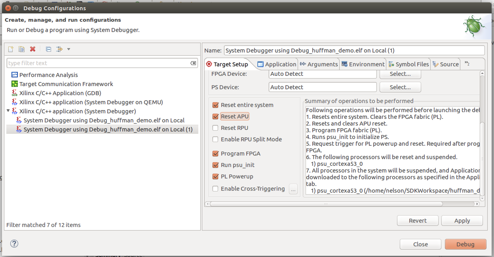
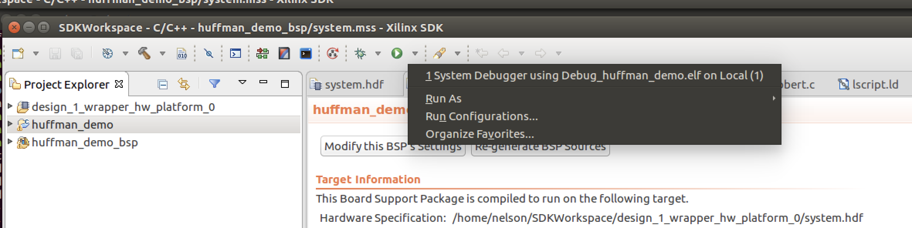
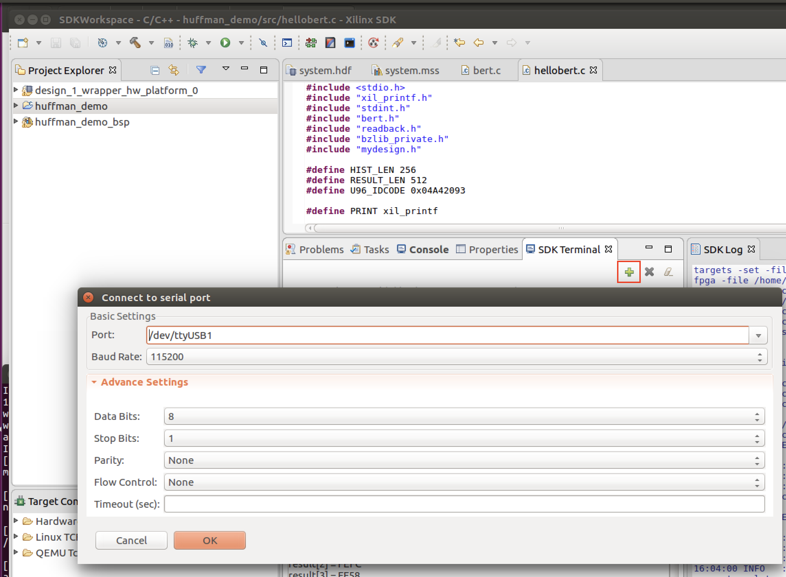
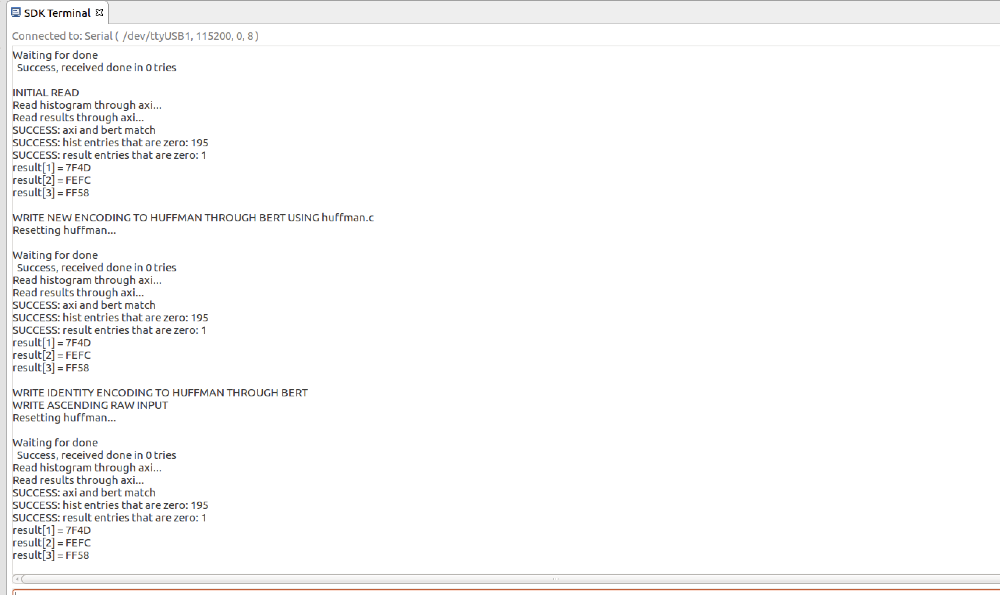

# Huffman Encoder Tutorial
## Overview
This tutorial will lead you through using BERT to read and write memories in a hardware design.

The hardware for the project is a Huffman Encoder design where 4 memories are used:
* A 1024x8b memory with 8b characters that will be encoded, called `rawTextMem`
* A 256x20b memory with character encodings, called `huffmanMem`. Bits [15:0] of each word are the encoding. Bits [19:16] are the length of the encoding.
* A 512x16b memory with that stores the encoding of `rawTextMem`, called `resultsMem`
* A 256x16b memory that stores a histogram of `rawTextMem`'s values, called `histMem`

In the design, the memories can be read and written by BERT.  However, we have also hooked the memories up to the AXI bus so we can also read and write them that way to verify BERT's correct operation.


When the design is running if the sotware  toggles a register bit on the AXI bus, that will cause the encoder to run and the  `resultsMem` to be updated with the encoding of `rawTextMem`, based on the dictionary found in `huffmanMem`. 

During runtime, the software can do the following by writing or reading the BRAMs in the hardware:
* Setting the text that needs to be encoded
* Providing different Huffman dictionaries for the hardware encoder as needed
* Debugging by reading memories that wouldn't ordinarilly be exposed to AXI, like `histMem`.

This tutorial will demonstrate performing these hypothetical scenarios with the BERT API. Additionally, this document serves to explain how to get BERT working with any hardware design. Every step is covered from start to finish, with links to documents providing further information. 

Finally, this tutorial is written with the Eclipse-based Xilinx SDK in mind. The [Xilinx article on migrating to Vitis](https://www.xilinx.com/html_docs/xilinx2020_1/vitis_doc/migratingtovitis.html) may help in adapting these instructions for newer versions of the Xilinx tools.

## Prerequisites
This tutorial assumes the user has some experience with using the Xilinx SDK tool to create, configure, edit, compile, and run designs consisting of hardware and software on an FPGA board.

TODO: could we point them at some introductory materials to use?  Can we articulate the level of expertise they might need?  A number of the problems BEN and AMD had with the tutorial as written was due to what looked to us to be omited details on the SDK operation that we were not familiar with.

The tutorial also assumes you have the following installed:
* Xilinx SDK
* Python3


## The Overall Process
Using BERT is a 5-step process.  
1. You use Vivado to generate a design containing BRAMs and a PS.  Once you have generated a bitstream for the design you run a script to generate the needed data files for the remainder of the BERT process.  You do this on a "host" computer, meaning one that runs Vivado.
2. You then set up the Xilinx SDK environment with the right versions of
the xilfpga program from Xilinx.  This only needs to be done once per
installation site.
3. You then create an SDK project for the provided hardware design.  As a part of this you setup your board-support package with the needed libraries for BERT. 
4. Once this is all in place, you will install the BERT source code itself inside your application and write your user application code, all of which will compile into a BERT executable that uses BERT to talk to the board after you have programmed it with a bitstream.  
5. You will finally test that application on hardware with a bitstream programmed onto the board.

NOTE: along the way you will be copying files into the SDK project directories.   As you do so you may see compile errors in the Project Explorer window on the left of the SDK.  Don't worry.  You will have such compile errors until right at the end of Step 3 below so don't worry about them until you get to that point!  The tutorial will tell you at what point you should not have compile errors any more.

# Step 1. Obtaining A Sample Design
As mentioned, you need to create your hardware design in Vivado and compile it to a bitstream and then write out the needed files for BERT to use your design.

For this tutorial, however, a complete set of such files are provided for you within the bert GIT repo for the Ultra96-V2 board to save time.  You can find those in this directory: `.../bert/docs/tutorials/huffman/hw_huffman` in the repo.  Copy the files from there into a directory where you intend to work through this tutorial (which we will refer to as `WORK` for the rest of the tutorial).  Also, when we refer to paths like `.../bert/` we are referring to the location where you have checked out the github BERT repo into (an example would be `/home/steve/bert`).

# Step 2. Setup Xilinx SDK With The Proper Libraries.
The next step is to set up the Xilinx SDK environment.  This tutorial was written for Vivado 2018.3 but the BERT tools require `xilfpga` libraries for 2019.2 and so there are a number of steps required to get the proper libraries and files set up. Follow the instructions [here on 2018.3 setup](../../embedded/xilinx2018_3.md).  This will set files you need in your SDK environment.  You should only have to do this
  once per installation site.

# Step 3. Create an SDK Project and Modify the BSP With the Proper Library Code
* Step 3a - follow the instructions
  [here on Application Project Setup](../sdksetup.md).  This will create
  the application project.

* Step 3b - you next need to add some required libraries to your BSP.  The
  document [bsp.md](../../embedded/bsp.md) covers which libraries and
  versions you will need for BERT as well as other additional steps.  Complete those steps before proceeding.

* Step 3c - you now should check the project's link settings.  This is because adding a library to a BSP after a project has already been formulated sometimes causes an issue where the 'makefile' is not updated to link against the new libary. If you are getting compiler errors, you can check that the right flags are set by opening the application project's properties (right-click `huffman_demo` and choose C/C++ Build Settings).   Then, go to ARM v8 gcc linker -> Inferred Options -> Software Platform. The specific flags you are looking for as they relate to BERT include:

* `-Wl,--start-group,-lxilfpga,-lxil,-lxilsecure,-lgcc,-lc,--end-group`
*  `-Wl,--start-group,-lxilsecure,-lxil,-lgcc,-lc,--end-group`

NOTE: we have seen these get reset by the SDK when switching workspaces, among other things.  So. if at the end of the process you are getting compile errors, re-check these settings!

# 4. Integrating BERT into Your Project and Writing Your Source Code
Now that we have an application project and BSP established, we need to assemble the needed source code files to create our BERT application.  To simplify this a script has been created which will copy the needed files into your `WORK/SDKWorkspace/huffman_demo/src` directory for you.  Before you run that script, here are the files that will be copied:

1. The BERT source files (which make it run) are found in `.../bert/embedded/src/bert`.
2. The `mydesign.c` and `mydesign.h` files you copied into `WORK` at the start of this tutorial into your `WORK` directory.  These define a set of data structures that describe, for the BERT system, the names, locations, and contents of the BRAMs in the specific hardware design that will be executed.
3. The actual application you run that uses the above files to interact with your hardware design is called `hellobert.c`. It is found in `.../bert/docs/tutorials/huffman/sw_huffman` (along with a set of support source files it need).

So, now run the provided script which will copy all of the above files into your `WORK/SDKWorkspace'huffman_demo/src` directory:
```
python3 BERT/docs/tutorials/huffman/copyappfiles.py WORK
```

Finally, you may also see that your  `WORK/SDKWorkspace/huffman_demo/src` directory has a `helloworld.c` file (often automatically created by SDK when you create the application).  If so, remove that file before proceeding.
## The Application
The provided `hellobert.c` application source code (mentioned above) does the following:

* Reads the memories' contents from the design using both the AXI interface as well as the BERT interface.  It then compares the results of those reads to verify BERT is working.
* After that, it uses a bzip2 implementation of Huffmann encoding to create a new encoding table and writes that new encoding table into `huffmanMem` memory in the running design via BERT.
* It then writes ascending input to the `rawTextMem` and an identity encoding as the Huffman table in the running design, and then checks the encoded results in the `resultMem` to verify they are correct.

The application allocates memory to use for its activities.  Before executing it, you need to tell the SDK how much memory it will use.  To do this, edit the `ldscript.ld` in SDK:
* on the left, if necessary, click on triangle to the left of huffman_demo to list its contents
* click on triangle to the left of src to list its contents
*  double-click the on `lscript.ld` file to open.

Then  set the stack and heap sizes to 200000 (2 followed by 5 zeros -- this is hex for 2 Megabytes).  [For a discussion on how to size heap, see the Usage Overview->Dynamic Memory Usage section in [the BERT API documentation](../../embedded/bert.md).] Once changed select File>Save from top menu.

At this point you FINALLY have a complete application and it should show no compile  errors in Project Explorer!  As described above you should right-click the application (`huffman_demo`) in the Project Explorer and select 'Clean Project' to ensure that you now have a full, clean recompilation.

Note: the `copyappfiles.py` script copied a number of source files to assemble what you need for a BERT application to run.  By examining the output printed out while running that script you should be able to review which pieces of source code were copied into your SDK `huffman_demo` project.  You can use the output of `copyappfiles.py` as a guide when you get ready to do your new design later and have to assemble the source code files ourself.

## 5. Test on hardware

Once the code compiles, you are ready to run it on hardware. Start by opening "Run Configurations."  You can do this by right-clicking on the project application ('huffman_demo') and selecting 'Run As->Run Configurations'.  Then double-click the bottom option in the window that pops up ('Xilinx C/C++ application (System Debugger)').  

In the Target Setup pane to the right you will need to select a number of reset options like below:



In addition you will have to fill in the name of the bitfile to use.  You do this by clicking the Browse Button.
You want to select the file `WORK/top.bit`.
Once you have done so, click Apply and then Close.  At this point you have a new configuration you can use when you run with or without the debugger.

As shown below, to run, click the green circle with white triangle at the top center of the screen.  This will run what you just created.



Watch the lower right screen - you will see it going thhrough a whole series of startup steps - loading code, programming the FPGA, resetting the system, etc.  This can take as long as 30 seconds.  When it all finishes and runs the actual application the focus will switch to the console window in the lower center of the screen.  That will be your cue that the application has run.  You can click on the 'SDK Terminal' tab to see the results of the run.

Before or during the launch of the program, open the serial port to the board so you can observe the program output. Clicking the green plus ('+') sign in the "SDK Terminal" tab's window accomplishes this.  On Windows it will be a COM port, on Linux it will be /dev/ttyUSB1.



Alternatively, you can run the debugger using the debug icon just to the left of the run button (this icon looks like a bug).  This will run the debugger.  The debugger will start up with a breakpoint at main.  To resume execution, select Core 0 and press the `resume` button, which is shaped like a play button (rectangle followed by green arrow, two icons over from the run button).

If all goes well, the program will run and will print results to the SDK Terminal as shown below:



Congratulations!  You have run a successful demo application.

Obvious next steps would be to experiment with making changes to the
`hellobert.c` program and re-run it on the board to gain some experience
with the board and the BERT API.  Then, work your way through the second
BERT tutorial,
[Preparing Needed Files for the Huffman Encoding Tutorial](fileprep.md), to
learn how to generate the files needed from a Vivado design for the entire
process (these are the files that were given to you at the start of this
tutorial).

Other things you can do:
* Run a [timing version of `hellobert.c`](timing/README.md) to capture
times for bert operations and components
* Compile with -O3  to run translation fast
  * Right click huffman_demo on left pane and right click to select properties
  * Look under C/C++ Build > Settings
  * Then look under ARMv8 gcc compiler > Optimizations
  * Set Optimization Level
  * Click Apply
  * Click OK
* Run an [accelerated version of translation](accel/README.md) to speed up
  translation on simpler memories (all the memories in this design are
  simple enough)
* To change the DMA transfer speed, modify PCAP_READ_DIV or PCAP_WRITE_DIV in xilfpga_pcap.h in the BSP file
  * By default, we have it set to a high speed that works for us
    * set it lower (higher values) if that times out for you
    * set it higher (lower values) if you want to try running faster
    * default value of 10 corresponds to about 150MHz; highest value of 63 (default from Xilinx) is about 25MHz
  * On the project navigator plane on left
    * open huffman_demo_bsp
    * open psu_cortexa53_0
    * open libsrc
    * open xilfpga_v5_1
    * open source
    * double click on `xilfpga_pcap.h`
  * look for `#define` for `PCAP_READ_DIV` (`PCA_WRITE_DIV` is right after it)
  * change values there
  * save file (File>Save)
* TODO Warn them about (* dont_touch = "true" *) to keep memories from disappearing
* TODO Warn them about having the wrong cmake due to source-ing Xilinx settings64.sh file
* TODO maybe get build error at end of setup (GetPLConfigData too many arguments, maybe from stale (original) xilfpga vs. extended version) -- Project > Clean to rebuild?
---

TODO:
* Mention the on button and reset button on board
* Mention compiling application with -O3 (Perhaps find a way for SDK to only compile BERT -O3)
* Section on how to Debug

