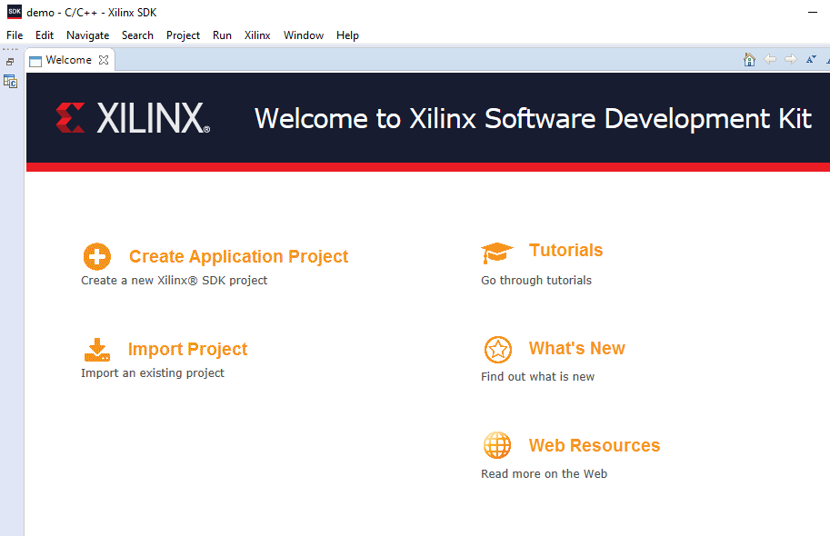
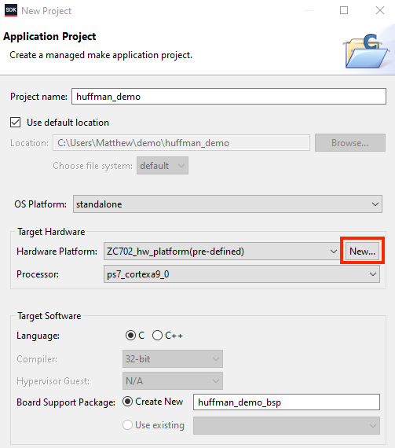
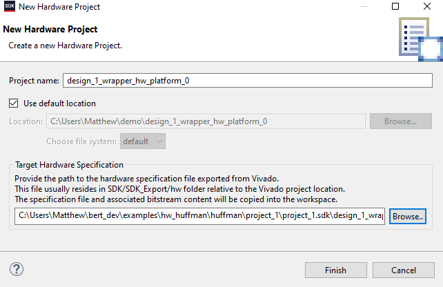
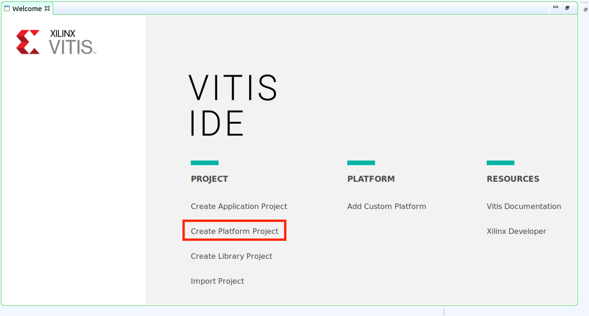
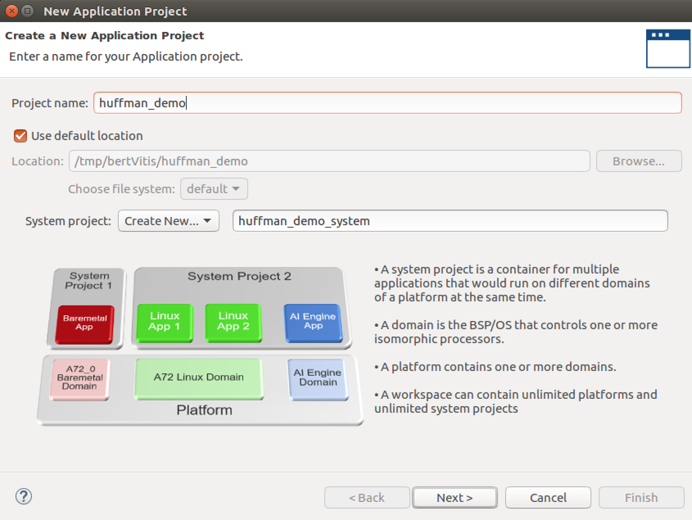
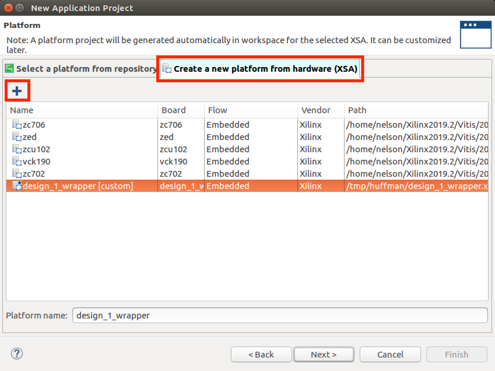

# Setting Up Xilinx SDK/Vitis Environment
The typical way of getting a design into the SDK/Vitis so you can test it is to create a design yourself in Vivado.  You would then do `File->Export->Export Hardware`.  This will generate a hardware description file (.hdf or .xsa) and a .bit file which the SDK/Vitis then uses to create a project when it starts up.   Next, do a `File->Launch SDK` or `Tools->Launch Vitis` to start the SDK/Vitis with the right environment  

However, you are not doing things that way for this tutorial.  As instructed in the Huffman Tutorial page, you previously copied the files generated by the above export hardware step from `.../bert/docs/tutorials/huffman/hw_huffman_TOOL` to save time.  So, let's get on with using those in the SDK/Vitis to manually create a project for the provided design.

## SDK Instructions

### 1. Launch SDK
Open the SDK and establish a new workspace in a directory of your choosing (if you already have a workspace open (you have previously run SDK/Vitis), choose `File->Switch Workspace->Other`).  For this tutorial, use `WORK/SDKWorkspace` as your workspace (where `WORK` is the directory you copied the above files into in a previous step).

### 2. Create application project alongside Platform and BSP

Create a new application by clicking the "Create Application Project" link as shown below.

Give the project a name - for this demo use `huffman_demo`. Next, before clicking OK, next to 'Hardware Platform' click the 'New...' button.

Then, using the 'Target Hardware Specification' Browse button, browse to the .hdf file in your working directory (`WORK`).  The SDK will then fill in the
hardware project name based on that.  Now click Finish.

Now click finish again and you are brought back to the Project Explorer.  At this point you should have three items in the SDK left-side Project Explorer pane:
- One will be `top_hw_platform_0` and is the hardware for the project.  
- One will be `huffman_demo` which is the software application for the project.
- One will be `huffman_demo_bsp` and is the board support package.

## Vitis Instructions

### 1. Launch Vitis
After launching Vitis, for the workspace to switch use the WORK directory you copied the files into above.  NOTE: this is different from the SDK instructions above where you created a subdirectory inside of WORK.  Just use WORK in this case.

### 2. Create Hardware Platform and Application Project
Next you need to create a hardware platform.  Create one by clicking "Create 
Create a new application by clicking the "Create Application Project" link as shown below.

Give the project a name - for this demo use `huffman_demo`. Next, check to make sure the "Create New" is selected in "System Project" and that it has auto-filled in the name for the system project of `huffman_demo_system`.  Then, click Next.

Then, select 'Create a new platform from hardware (XSA)', then the '+' button, then browse to the .xsa file in your working directory (`WORK`).  Then select the newly added item to the list of platforms ('top') and click Next.

Now click Next again, select the 'Hello World' template, click Finish and you are brought back to the Project Explorer.  At this point you should have two items in the SDK left-side Project Explorer pane:
- One will be `top` and is the hardware for the project.  
- The other will be `huffman_demo_system` which is the board support package for your project.  Inside it is `huffman_demo` which is the actual software application for the project.  

At this point you can click Back to return to the main tutorial.
